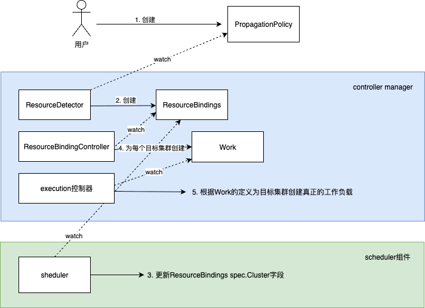

# &#x20;使用场景介绍

# 源码分析其实现流程

## 创建多集群调度策略

对于使用者来看，多集群调度策略是由下面2个crd来定义：

- PropagationPolicy
- ClusterPropagationPolicy

它们的区别：ClusterPropagationPolicy的作用域集群级别，无需定义namespace，资源选择也是集群级别的资源，如namespace, crd等，对于开发者来说主要是使用PropagationPolicy，而ClusterPropagationPolicy一般是给管理员使用。所以本文主要就PropagationPolicy相关的源代码进行阐述。

## 多集群调度实现及源码分析

### 概述

当用户创建完PropagationPolicy后，karmada为了实现多集群调度，controller-manager、scheduler等创建一系列的crd，并最终调用目标集群的api创建工作负载。可用如下一张草图来简要地描述整个流程。


如图所示：
- 1 用户创建crd: PropagationPolicy
- 2 controller-manager中ResourceDetector控制器监听到PropagationPolicy的创建事件，根据PropagationPolicy的定义创建crd: ResourceBindings。注意：此时ResourceBindings的spec.Cluster字段为空，即还没有把工作负载分配到目标集群。
- 3 scheduler会监听到ResourceBindings的创建事件，根据ResourceBindings中spec.Placement的定义，按照一定的算法确定工作负载将调度到哪些目标集群及确定对应的副本数
- 4 controller-manager中ResourceBindings控制器为每个目标集群，按照ResourceBindings中工作负载的定义创建crd: Work
- 5 controller-manager中execution控制器根据work的定义，调用目标集群api，创建真正工作负载

### ResourceDetector控制器创建ResourceBindings
当用户创建完PropagationPolicy后，ResourceDetector作为crd-PropagationPolicy的控制器，定义了PropagationPolicy informer，informer会触发事件处理函数。代码如下：

```go
    resourceDetector := &detector.ResourceDetector{
		DiscoveryClientSet:                      discoverClientSet,
		Client:                                  mgr.GetClient(),
		InformerManager:                         controlPlaneInformerManager,
		ControllerRuntimeCache:                  mgr.GetCache(),
		RESTMapper:                              mgr.GetRESTMapper(),
		DynamicClient:                           dynamicClientSet,
		SkippedResourceConfig:                   skippedResourceConfig,
		SkippedPropagatingNamespaces:            opts.SkippedNamespacesRegexps(),
		ResourceInterpreter:                     resourceInterpreter,
		EventRecorder:                           mgr.GetEventRecorderFor("resource-detector"),
		ConcurrentPropagationPolicySyncs:        opts.ConcurrentPropagationPolicySyncs,
		ConcurrentClusterPropagationPolicySyncs: opts.ConcurrentClusterPropagationPolicySyncs,
		ConcurrentResourceTemplateSyncs:         opts.ConcurrentResourceTemplateSyncs,
		RateLimiterOptions:                      opts.RateLimiterOpts,
	}

	if err := mgr.Add(resourceDetector); err != nil {
		klog.Fatalf("Failed to setup resource detector: %v", err)
	}
```

mgr 启动后，自动调用resourceDetector 的Start 函数。在Start 函数中使用policyReconcileWorker，对 PropagationPolicy 的新增、修改、删除事件进行处理。

```go
func (d *ResourceDetector) Start(ctx context.Context) error {
	... ...
	// setup policy reconcile worker
	policyWorkerOptions := util.Options{
		Name:               "propagationPolicy reconciler",
		KeyFunc:            NamespacedKeyFunc,
		ReconcileFunc:      d.ReconcilePropagationPolicy,
		RateLimiterOptions: d.RateLimiterOptions,
	}
	d.policyReconcileWorker = util.NewAsyncWorker(policyWorkerOptions)
	d.policyReconcileWorker.Run(ctx, d.ConcurrentPropagationPolicySyncs)

	... ...
	detectorWorkerOptions := util.Options{
		Name:               "resource detector",
		KeyFunc:            ResourceItemKeyFunc,
		ReconcileFunc:      d.Reconcile,
		RateLimiterOptions: d.RateLimiterOptions,
	}
	d.Processor = util.NewAsyncWorker(detectorWorkerOptions)
	d.Processor.Run(ctx, d.ConcurrentResourceTemplateSyncs)

	... ...
	  // watch and enqueue PropagationPolicy changes.
	policyHandler := fedinformer.NewHandlerOnEvents(d.OnPropagationPolicyAdd, d.OnPropagationPolicyUpdate, nil)
	ppInformer, err := d.ControllerRuntimeCache.GetInformer(ctx, &policyv1alpha1.PropagationPolicy{})
	if err != nil {
		klog.Errorf("Failed to get informer for PropagationPolicy: %v", err)
		return err
	}
	// 注册事件处理函数
	_, err = ppInformer.AddEventHandler(policyHandler)
	if err != nil {
		klog.Errorf("Failed to add event handler for PropagationPolicy: %v", err)
		return err
	}
}
func (d *ResourceDetector) OnPropagationPolicyUpdate(oldObj, newObj interface{}) {
	// policyReconcileWorker 对象入队
	d.policyReconcileWorker.Enqueue(newObj)
	... ...
}
```

其中

- policyReconcileWorker 定义为 AsyncWorker，它从工作队列取出 PropagationPolicy 的key，调用其ReconcileFunc，即ReconcilePropagationPolicy函数，下面看 ReconcilePropagationPolicy 的详细定义
- 另外还定义了 Processor，也是1个AsyncWorker，它从工作队列取出 ClusterWideKeyWithConfig 的key, 调用其ReconcileFunc，即Reconcile函数

```go
func (d *ResourceDetector) ReconcilePropagationPolicy(key util.QueueKey) error {
	nkey, ok := key.(keys.NamespacedKey)
	if !ok { // should not happen
		klog.Error("Found invalid key when reconciling propagation policy.")
		return fmt.Errorf("invalid key")
	}
	propagationObject := &policyv1alpha1.PropagationPolicy{}
	err := d.Client.Get(context.TODO(), client.ObjectKey{Namespace: nkey.Namespace, Name: nkey.Name}, propagationObject)
	if err != nil {
		if apierrors.IsNotFound(err) {
			return nil
		}
		klog.Errorf("Failed to get PropagationPolicy(%s): %v", nkey.NamespaceKey(), err)
		return err
	}

	... ... 

	klog.Infof("PropagationPolicy(%s) has been added or updated.", nkey.NamespaceKey())
	return d.HandlePropagationPolicyCreationOrUpdate(propagationObject)
}

func (d *ResourceDetector) HandlePropagationPolicyCreationOrUpdate(policy *policyv1alpha1.PropagationPolicy) error {
	... ...
	policyID := policy.Labels[policyv1alpha1.PropagationPolicyPermanentIDLabel]
	... ...

	// 根据policyID，获取resourceBindings
	resourceBindings, err := d.listPPDerivedRBs(policyID, policy.Namespace, policy.Name)
	if err != nil {
		return err
	}
	for _, rb := range resourceBindings.Items {
		resourceKey, err := helper.ConstructClusterWideKey(rb.Spec.Resource)
		... ...
		// 进入 d.Processor 所在队列，其key 为ClusterWideKeyWithConfig
		d.Processor.Add(keys.ClusterWideKeyWithConfig{ClusterWideKey: resourceKey, ResourceChangeByKarmada: true})
	}

	// check whether there are matched RT in waiting list, is so, add it to processor
	matchedKeys := d.GetMatching(policy.Spec.ResourceSelectors)
	klog.Infof("Matched %d resources by policy(%s/%s)", len(matchedKeys), policy.Namespace, policy.Name)
	
	... ...
	for _, key := range matchedKeys {
		d.RemoveWaiting(key)
		// 进入 d.Processor 所在队列，其key 为ClusterWideKeyWithConfig
		d.Processor.Add(keys.ClusterWideKeyWithConfig{ClusterWideKey: key, ResourceChangeByKarmada: true})
	}
	... ...

	return nil
}
```

当进入 d.Processor 所在队列 后，会直接调用 Reconcile 函数，下面看Reconcile的处理逻辑

```go
func (d *ResourceDetector) Reconcile(key util.QueueKey) error {
	clusterWideKeyWithConfig, ok := key.(keys.ClusterWideKeyWithConfig)
	... ...
	clusterWideKey := clusterWideKeyWithConfig.ClusterWideKey
	resourceChangeByKarmada := clusterWideKeyWithConfig.ResourceChangeByKarmada
	klog.Infof("Reconciling object: %s", clusterWideKey)

	object, err := d.GetUnstructuredObject(clusterWideKey)
	... ...

	resourceTemplateClaimedBy := util.GetLabelValue(object.GetLabels(), util.ResourceTemplateClaimedByLabel)
	... ...

	return d.propagateResource(object, clusterWideKey, resourceChangeByKarmada)
}

func (d *ResourceDetector) propagateResource(object *unstructured.Unstructured,
	objectKey keys.ClusterWideKey, resourceChangeByKarmada bool) error {
	// 1. Check if the object has been claimed by a PropagationPolicy,
	// if so, just apply it.
	policyAnnotations := object.GetAnnotations()
	policyLabels := object.GetLabels()
	claimedNamespace := util.GetAnnotationValue(policyAnnotations, policyv1alpha1.PropagationPolicyNamespaceAnnotation)
	claimedName := util.GetAnnotationValue(policyAnnotations, policyv1alpha1.PropagationPolicyNameAnnotation)
	claimedID := util.GetLabelValue(policyLabels, policyv1alpha1.PropagationPolicyPermanentIDLabel)
	if claimedNamespace != "" && claimedName != "" && claimedID != "" {
		return d.getAndApplyPolicy(object, objectKey, resourceChangeByKarmada, claimedNamespace, claimedName, claimedID)
	}

	// 2. Check if the object has been claimed by a ClusterPropagationPolicy,
	// if so, just apply it.
	claimedName = util.GetAnnotationValue(policyAnnotations, policyv1alpha1.ClusterPropagationPolicyAnnotation)
	claimedID = util.GetLabelValue(policyLabels, policyv1alpha1.ClusterPropagationPolicyPermanentIDLabel)
	if claimedName != "" && claimedID != "" {
		return d.getAndApplyClusterPolicy(object, objectKey, resourceChangeByKarmada, claimedName, claimedID)
	}

	// 3. attempt to match policy in its namespace.
	start := time.Now()
	propagationPolicy, err := d.LookForMatchedPolicy(object, objectKey)
	if err != nil {
		klog.Errorf("Failed to retrieve policy for object: %s, error: %v", objectKey.String(), err)
		return err
	}
	if propagationPolicy != nil {
		// return err when dependents not present, that we can retry at next reconcile.
		if present, err := helper.IsDependentOverridesPresent(d.Client, propagationPolicy); err != nil || !present {
			klog.Infof("Waiting for dependent overrides present for policy(%s/%s)", propagationPolicy.Namespace, propagationPolicy.Name)
			return fmt.Errorf("waiting for dependent overrides")
		}
		d.RemoveWaiting(objectKey)
		metrics.ObserveFindMatchedPolicyLatency(start)
		return d.ApplyPolicy(object, objectKey, resourceChangeByKarmada, propagationPolicy)
	}

	// 4. reaching here means there is no appropriate PropagationPolicy, attempt to match a ClusterPropagationPolicy.
	clusterPolicy, err := d.LookForMatchedClusterPolicy(object, objectKey)
	if err != nil {
		klog.Errorf("Failed to retrieve cluster policy for object: %s, error: %v", objectKey.String(), err)
		return err
	}
	if clusterPolicy != nil {
		// return err when dependents not present, that we can retry at next reconcile.
		if present, err := helper.IsDependentClusterOverridesPresent(d.Client, clusterPolicy); err != nil || !present {
			klog.Infof("Waiting for dependent overrides present for policy(%s)", clusterPolicy.Name)
			return fmt.Errorf("waiting for dependent overrides")
		}
		d.RemoveWaiting(objectKey)
		metrics.ObserveFindMatchedPolicyLatency(start)
		return d.ApplyClusterPolicy(object, objectKey, resourceChangeByKarmada, clusterPolicy)
	}

	if d.isWaiting(objectKey) {
		// reaching here means there is no appropriate policy for the object
		klog.V(4).Infof("No matched policy for object: %s", objectKey.String())
		return nil
	}

	// put it into waiting list and retry once in case the resource and propagation policy come at the same time
	// see https://github.com/karmada-io/karmada/issues/1195
	d.AddWaiting(objectKey)
	return fmt.Errorf("no matched propagation policy")
}

// 最后都会调用此函数，这里根据 PropagationPolicy 的策略创建 ResourceBindings 
func (d *ResourceDetector) ApplyPolicy(object *unstructured.Unstructured, objectKey keys.ClusterWideKey,
	resourceChangeByKarmada bool, policy *policyv1alpha1.PropagationPolicy) (err error) {
	... ...
	// 构建ResourceBinding
	binding, err := d.BuildResourceBinding(object, &policy.Spec, policyID, policy.ObjectMeta, AddPPClaimMetadata)
	if err != nil {
		klog.Errorf("Failed to build resourceBinding for object: %s. error: %v", objectKey, err)
		return err
	}
	bindingCopy := binding.DeepCopy()
	err = retry.RetryOnConflict(retry.DefaultRetry, func() (err error) {
		// 创建或更新ResourceBinding
		operationResult, err = controllerutil.CreateOrUpdate(context.TODO(), d.Client, bindingCopy, func() error {
			// If this binding exists and its owner is not the input object, return error and let garbage collector
			// delete this binding and try again later. See https://github.com/karmada-io/karmada/issues/2090.
			if ownerRef := metav1.GetControllerOfNoCopy(bindingCopy); ownerRef != nil && ownerRef.UID != object.GetUID() {
				return fmt.Errorf("failed to update binding due to different owner reference UID, will " +
					"try again later after binding is garbage collected, see https://github.com/karmada-io/karmada/issues/2090")
			}

			// Just update necessary fields, especially avoid modifying Spec.Clusters which is scheduling result, if already exists.
			bindingCopy.Annotations = util.DedupeAndMergeAnnotations(bindingCopy.Annotations, binding.Annotations)
			bindingCopy.Labels = util.DedupeAndMergeLabels(bindingCopy.Labels, binding.Labels)
			bindingCopy.Finalizers = util.DedupeAndMergeFinalizers(bindingCopy.Finalizers, binding.Finalizers)
			bindingCopy.OwnerReferences = binding.OwnerReferences
			bindingCopy.Spec.Resource = binding.Spec.Resource
			bindingCopy.Spec.ReplicaRequirements = binding.Spec.ReplicaRequirements
			bindingCopy.Spec.Replicas = binding.Spec.Replicas
			bindingCopy.Spec.PropagateDeps = binding.Spec.PropagateDeps
			bindingCopy.Spec.SchedulerName = binding.Spec.SchedulerName
			bindingCopy.Spec.Placement = binding.Spec.Placement
			bindingCopy.Spec.Failover = binding.Spec.Failover
			bindingCopy.Spec.ConflictResolution = binding.Spec.ConflictResolution
			bindingCopy.Spec.PreserveResourcesOnDeletion = binding.Spec.PreserveResourcesOnDeletion
			bindingCopy.Spec.SchedulePriority = binding.Spec.SchedulePriority
			if binding.Spec.Suspension != nil {
				if bindingCopy.Spec.Suspension == nil {
					bindingCopy.Spec.Suspension = &workv1alpha2.Suspension{}
				}
				bindingCopy.Spec.Suspension.Suspension = binding.Spec.Suspension.Suspension
			}
			excludeClusterPolicy(bindingCopy)
			return nil
		})
		if err != nil {
			return err
		}
		return nil
	})
	if err != nil {
		klog.Errorf("Failed to apply policy(%s) for object: %s. error: %v", policy.Name, objectKey, err)
		return err
	}

	switch operationResult {
	case controllerutil.OperationResultCreated:
		klog.Infof("Create ResourceBinding(%s/%s) successfully.", binding.GetNamespace(), binding.GetName())
	case controllerutil.OperationResultUpdated:
		klog.Infof("Update ResourceBinding(%s/%s) successfully.", binding.GetNamespace(), binding.GetName())
	default:
		klog.V(2).Infof("ResourceBinding(%s/%s) is up to date.", binding.GetNamespace(), binding.GetName())
	}

	return nil
}
```
到这里创建了 ResourceBindings, 值得注意的是此时新创建ResourceBindings的 Clusters 字段值为空，也就是 karmada 调度器还没有为其分配集群。

小结：控制器 ResourceDetector 会监听 crd -- PropagationPolicy 的创建或更新，根据PropagationPolicy的定义创建ResourceBindings。

### scheduler 为ResourceBindings分配目标集群

scheduler 注册ResourceBindings事件处理函数

```go
func NewScheduler(dynamicClient dynamic.Interface, karmadaClient karmadaclientset.Interface, kubeClient kubernetes.Interface, opts ...Option) (*Scheduler, error) {
    factory := informerfactory.NewSharedInformerFactory(karmadaClient, 0)
    bindingLister := factory.Work().V1alpha2().ResourceBindings().Lister()
    clusterBindingLister := factory.Work().V1alpha2().ClusterResourceBindings().Lister()
    clusterLister := factory.Cluster().V1alpha1().Clusters().Lister()
    schedulerCache := schedulercache.NewCache(clusterLister)
	... ...

	sched := &Scheduler{
        DynamicClient:        dynamicClient,
        KarmadaClient:        karmadaClient,
        KubeClient:           kubeClient,
        bindingLister:        bindingLister,
        clusterBindingLister: clusterBindingLister,
        clusterLister:        clusterLister,
        informerFactory:      factory,
        queue:                legacyQueue,
        priorityQueue:        priorityQueue,
        Algorithm:            algorithm,
        schedulerCache:       schedulerCache,
    }
	... ...
	sched.addAllEventHandlers()
}

func (s *Scheduler) addAllEventHandlers() {
    bindingInformer := s.informerFactory.Work().V1alpha2().ResourceBindings().Informer()
    _, err := bindingInformer.AddEventHandler(cache.FilteringResourceEventHandler{
            FilterFunc: s.resourceBindingEventFilter,
            Handler: cache.ResourceEventHandlerFuncs{
                AddFunc:    s.onResourceBindingAdd,
				UpdateFunc: s.onResourceBindingUpdate,
            },
    })

}

func (s *Scheduler) onResourceBindingAdd(obj interface{}) {
    if features.FeatureGate.Enabled(features.PriorityBasedScheduling) {
        bindingInfo := newQueuedBindingInfo(obj)
        if bindingInfo == nil {
            // shouldn't happen
            klog.Errorf("couldn't convert to QueuedBindingInfo %#v", obj)
            return
        }

        s.priorityQueue.Push(bindingInfo)
    } else {
        key, err := cache.MetaNamespaceKeyFunc(obj)
        if err != nil {
            klog.Errorf("couldn't get key for object %#v: %v", obj, err)
        return
        }
		// 入队
        s.queue.Add(key)
    }
    metrics.CountSchedulerBindings(metrics.BindingAdd)
}
```

#### scheduler根据算法生成ResourceBindings的Clusters字段

```go
func (s *Scheduler) doSchedule(key string) error {
	ns, name, err := cache.SplitMetaNamespaceKey(key)
	if err != nil {
		return err
	}
	if len(ns) > 0 {
		return s.doScheduleBinding(ns, name)
	}
	return s.doScheduleClusterBinding(name)
}

func (s *Scheduler) doScheduleBinding(namespace, name string) (err error) {
	rb, err := s.bindingLister.ResourceBindings(namespace).Get(name)
	... ...

	rb = rb.DeepCopy()
	if rb.Spec.Placement == nil {
		// never reach here
		err = fmt.Errorf("failed to get placement from resourceBinding(%s/%s)", rb.Namespace, rb.Name)
		klog.Error(err)
		return err
	}

	start := time.Now()
	appliedPlacementStr := util.GetLabelValue(rb.Annotations, util.PolicyPlacementAnnotation)
	if placementChanged(*rb.Spec.Placement, appliedPlacementStr, rb.Status.SchedulerObservedAffinityName) {
		// policy placement changed, need schedule
		klog.Infof("Start to schedule ResourceBinding(%s/%s) as placement changed", namespace, name)
		err = s.scheduleResourceBinding(rb)
		metrics.BindingSchedule(string(ReconcileSchedule), utilmetrics.DurationInSeconds(start), err)
		return err
	}
	... ...
	return nil
}

func (s *Scheduler) scheduleResourceBinding(rb *workv1alpha2.ResourceBinding) (err error) {
	... ...
	return s.scheduleResourceBindingWithClusterAffinity(rb)
}

func (s *Scheduler) scheduleResourceBindingWithClusterAffinity(rb *workv1alpha2.ResourceBinding) error {
	... ...

	placementBytes, err := json.Marshal(*rb.Spec.Placement)
	if err != nil {
		klog.V(4).ErrorS(err, "Failed to marshal binding placement", "resourceBinding", klog.KObj(rb))
		return err
	}

	// 根据算法得到调度哪个集群、这些集群的副本数
	scheduleResult, err := s.Algorithm.Schedule(context.TODO(), &rb.Spec, &rb.Status, &core.ScheduleAlgorithmOption{EnableEmptyWorkloadPropagation: s.enableEmptyWorkloadPropagation})
	var fitErr *framework.FitError
	// in case of no cluster error, can not return but continue to patch(cleanup) the result.
	if err != nil && !errors.As(err, &fitErr) {
		s.recordScheduleResultEventForResourceBinding(rb, nil, err)
		klog.Errorf("Failed scheduling ResourceBinding(%s/%s): %v", rb.Namespace, rb.Name, err)
		return err
	}

	klog.V(4).Infof("ResourceBinding(%s/%s) scheduled to clusters %v", rb.Namespace, rb.Name, scheduleResult.SuggestedClusters)
	// patch ResourceBinding，即更新ResourceBinding的Clusters字段的值
	patchErr := s.patchScheduleResultForResourceBinding(rb, string(placementBytes), scheduleResult.SuggestedClusters)
	if patchErr != nil {
		err = utilerrors.NewAggregate([]error{err, patchErr})
	}
	s.recordScheduleResultEventForResourceBinding(rb, scheduleResult.SuggestedClusters, err)
	return err
}

func (g *genericScheduler) Schedule(
	ctx context.Context,
	spec *workv1alpha2.ResourceBindingSpec,
	status *workv1alpha2.ResourceBindingStatus,
	scheduleAlgorithmOption *ScheduleAlgorithmOption,
) (result ScheduleResult, err error) {
	clusterInfoSnapshot := g.schedulerCache.Snapshot()
	feasibleClusters, diagnosis, err := g.findClustersThatFit(ctx, spec, status, &clusterInfoSnapshot)
	if err != nil {
		return result, fmt.Errorf("failed to find fit clusters: %w", err)
	}

	// Short path for case no cluster fit.
	if len(feasibleClusters) == 0 {
		return result, &framework.FitError{
			NumAllClusters: clusterInfoSnapshot.NumOfClusters(),
			Diagnosis:      diagnosis,
		}
	}
	klog.V(4).Infof("Feasible clusters found: %v", feasibleClusters)
    
	// 为每个集群打分
	clustersScore, err := g.prioritizeClusters(ctx, g.scheduleFramework, spec, feasibleClusters)
	if err != nil {
		return result, fmt.Errorf("failed to prioritize clusters: %w", err)
	}
	klog.V(4).Infof("Feasible clusters scores: %v", clustersScore)

	// 根据算法选择集群
	clusters, err := g.selectClusters(clustersScore, spec.Placement, spec)
	if err != nil {
		return result, fmt.Errorf("failed to select clusters: %w", err)
	}
	klog.V(4).Infof("Selected clusters: %v", clusters)

	// 为每个集群分配副本数
	clustersWithReplicas, err := g.assignReplicas(clusters, spec, status)
	if err != nil {
		return result, fmt.Errorf("failed to assign replicas: %w", err)
	}
	klog.V(4).Infof("Assigned Replicas: %v", clustersWithReplicas)

	if scheduleAlgorithmOption.EnableEmptyWorkloadPropagation {
		clustersWithReplicas = attachZeroReplicasCluster(clusters, clustersWithReplicas)
	}
	result.SuggestedClusters = clustersWithReplicas

	return result, nil
}
```

也就是说，当controller manager 根据crd Propagation 创建 ResourceBindings 后， 此时，ResourceBindings字段的Clusters字段还是空，直到scheduler根据一定的算法把目标副本数分配到指定的集群中。


### ResourceBindings 控制器创建Worker

ResourceBindings控制器根据ResourceBindings的定义创建工作负载，比如如下定义：

```go
  clusters:
  - name: cl1
    replicas: 4
  conflictResolution: Abort
  failover:
    application:
      decisionConditions:
        tolerationSeconds: 180
      purgeMode: Immediately
  placement:
    clusterAffinity:
      clusterNames:
      - cl1
      - cl2
    clusterTolerations:
    - effect: NoExecute
      key: cluster.karmada.io/not-ready
      operator: Exists
      tolerationSeconds: 120
    - effect: NoExecute
      key: cluster.karmada.io/unreachable
      operator: Exists
      tolerationSeconds: 120
    replicaScheduling:
      replicaDivisionPreference: Weighted
      replicaSchedulingType: Divided
      weightPreference:
        staticWeightList:
        - targetCluster:
            clusterNames:
            - cl1
          weight: 1
        - targetCluster:
            clusterNames:
            - cl2
          weight: 2
  propagateDeps: true
  replicas: 4

```

比如上面的ResourceBindings 的定义中，定义了目标集群为c1,c2, 它们的权重分别是1:2, 除此之外还定义了集群的对污点的容忍等。

ResourceBindings控制器其实质是根据ResourceBindings的定义在命名空间`karmada-es-集群名`下面创建crd--Work， 下面看看ResourceBindings控制器的源码：

```go
func (c *ResourceBindingController) Reconcile(ctx context.Context, req controllerruntime.Request) (controllerruntime.Result, error) {
	klog.V(4).Infof("Reconciling ResourceBinding %s.", req.NamespacedName.String())

	binding := &workv1alpha2.ResourceBinding{}
	... ...

	return c.syncBinding(ctx, binding)
}

func (c *ResourceBindingController) syncBinding(ctx context.Context, binding *workv1alpha2.ResourceBinding) (controllerruntime.Result, error) {
	... ...
	// 根据模版定义工作负载
	workload, err := helper.FetchResourceTemplate(ctx, c.DynamicClient, c.InformerManager, c.RESTMapper, binding.Spec.Resource)
	... ...
	start := time.Now()
	err = ensureWork(ctx, c.Client, c.ResourceInterpreter, workload, c.OverrideManager, binding, apiextensionsv1.NamespaceScoped)
	... ...
	return controllerruntime.Result{}, nil
}

func ensureWork(
	ctx context.Context, c client.Client, resourceInterpreter resourceinterpreter.ResourceInterpreter, workload *unstructured.Unstructured,
	overrideManager overridemanager.OverrideManager, binding metav1.Object, scope apiextensionsv1.ResourceScope,
) error {
	bindingSpec := getBindingSpec(binding, scope)
	targetClusters := mergeTargetClusters(bindingSpec.Clusters, bindingSpec.RequiredBy)
	... ..
	// 为每个目标集群
	for i := range targetClusters {
		targetCluster := targetClusters[i]
		clonedWorkload := workload.DeepCopy()
		// 命名空间为：karmada-es-目标集群名称
		workNamespace := names.GenerateExecutionSpaceName(targetCluster.Name)
		... ...
        workMeta := metav1.ObjectMeta{
			Name:        names.GenerateWorkName(clonedWorkload.GetKind(), clonedWorkload.GetName(), clonedWorkload.GetNamespace()),
			Namespace:   workNamespace,
			Finalizers:  []string{util.ExecutionControllerFinalizer},
			Labels:      workLabel,
			Annotations: annotations,
		}

		if err = ctrlutil.CreateOrUpdateWork(
			ctx,
			c,
			workMeta,
			clonedWorkload,
			ctrlutil.WithSuspendDispatching(shouldSuspendDispatching(bindingSpec.Suspension, targetCluster)),
			ctrlutil.WithPreserveResourcesOnDeletion(ptr.Deref(bindingSpec.PreserveResourcesOnDeletion, false)),
		); err != nil {
			errs = append(errs, err)
			continue
		}
	}
	... ...
}

func CreateOrUpdateWork(ctx context.Context, c client.Client, workMeta metav1.ObjectMeta, resource *unstructured.Unstructured, options ...WorkOption) error {
	resource = resource.DeepCopy()
	... 
	// 自定义资源 Work
	work := &workv1alpha1.Work{
		ObjectMeta: workMeta,
	}

	applyWorkOptions(work, options)

	runtimeObject := work.DeepCopy()
	var operationResult controllerutil.OperationResult
	err = retry.RetryOnConflict(retry.DefaultRetry, func() (err error) {
		operationResult, err = controllerutil.CreateOrUpdate(ctx, c, runtimeObject, func() error {
			if !runtimeObject.DeletionTimestamp.IsZero() {
				return fmt.Errorf("work %s/%s is being deleted", runtimeObject.GetNamespace(), runtimeObject.GetName())
			}

			runtimeObject.Labels = util.DedupeAndMergeLabels(runtimeObject.Labels, work.Labels)
			runtimeObject.Annotations = util.DedupeAndMergeAnnotations(runtimeObject.Annotations, work.Annotations)
			runtimeObject.Finalizers = work.Finalizers
			runtimeObject.Spec = work.Spec

			// Do the same thing as the mutating webhook does, add the permanent ID to workload if not exist,
			// This is to avoid unnecessary updates to the Work object, especially when controller starts.
			//nolint:staticcheck // SA1019 ignore deprecated util.PropagationInstruction
			if runtimeObject.Labels[util.PropagationInstruction] != util.PropagationInstructionSuppressed {
				util.SetLabelsAndAnnotationsForWorkload(resource, runtimeObject)
			}
			workloadJSON, err := json.Marshal(resource)
			if err != nil {
				klog.Errorf("Failed to marshal workload(%s/%s), error: %v", resource.GetNamespace(), resource.GetName(), err)
				return err
			}
			runtimeObject.Spec.Workload = workv1alpha1.WorkloadTemplate{
				Manifests: []workv1alpha1.Manifest{
					{
						RawExtension: runtime.RawExtension{
							Raw: workloadJSON,
						},
					},
				},
			}
			return nil
		})
		return err
	})
	
	... ...
	return nil
}
```

### Work控制器-execution控制器创建crd: Work

Work 控制器监听到crd-Work的创建、更新、删除，根据Work的定义，在指定的目标集群创建相应的负载。

```go
func (c *Controller) Reconcile(ctx context.Context, req controllerruntime.Request) (controllerruntime.Result, error) {
	klog.V(4).Infof("Reconciling Work %s", req.NamespacedName.String())

	work := &workv1alpha1.Work{}
	if err := c.Client.Get(ctx, req.NamespacedName, work); err != nil {
		... ...
	}

	clusterName, err := names.GetClusterName(work.Namespace)
	... ...
	cluster, err := util.GetCluster(c.Client, clusterName)
	... ...

	return c.syncWork(ctx, clusterName, work)
}

func (c *Controller) syncWork(ctx context.Context, clusterName string, work *workv1alpha1.Work) (controllerruntime.Result, error) {
	start := time.Now()
	// 把工作负载同步到指定集群
	err := c.syncToClusters(ctx, clusterName, work)
	... ...
}

func (c *Controller) syncToClusters(ctx context.Context, clusterName string, work *workv1alpha1.Work) error {
	var errs []error
	syncSucceedNum := 0
	for _, manifest := range work.Spec.Workload.Manifests {
		workload := &unstructured.Unstructured{}
		err := workload.UnmarshalJSON(manifest.Raw)
		if err != nil {
			klog.Errorf("Failed to unmarshal workload of the work(%s/%s), error is: %v", work.GetNamespace(), work.GetName(), err)
			errs = append(errs, err)
			continue
		}

		// 创建工作负载
		if err = c.tryCreateOrUpdateWorkload(ctx, clusterName, workload); err != nil {
			... ... 	
		}
	}
	... ...

	return nil
}

func (c *Controller) tryCreateOrUpdateWorkload(ctx context.Context, clusterName string, workload *unstructured.Unstructured) error {
	fedKey, err := keys.FederatedKeyFunc(clusterName, workload)
	if err != nil {
		klog.Errorf("Failed to get FederatedKey %s, error: %v", workload.GetName(), err)
		return err
	}

	clusterObj, err := helper.GetObjectFromCache(c.RESTMapper, c.InformerManager, fedKey)
	if err != nil {
		... ... 
		// 创建
		err = c.ObjectWatcher.Create(ctx, clusterName, workload)
		metrics.CountCreateResourceToCluster(err, workload.GetAPIVersion(), workload.GetKind(), clusterName, false)
		if err != nil {
			return err
		}
		return nil
	}
	
	// 更新
	operationResult, err := c.ObjectWatcher.Update(ctx, clusterName, workload, clusterObj)
	metrics.CountUpdateResourceToCluster(err, workload.GetAPIVersion(), workload.GetKind(), clusterName, string(operationResult))
	if err != nil {
		return err
	}
	return nil
}

func (o *objectWatcherImpl) Create(ctx context.Context, clusterName string, desireObj *unstructured.Unstructured) error {
	// 获取目标集群client，其实质是从secret 中获取证书，创建连接目标集群的client
	dynamicClusterClient, err := o.ClusterClientSetFunc(clusterName, o.KubeClientSet, o.ClusterClientOption)
	if err != nil {
		klog.Errorf("Failed to build dynamic cluster client for cluster %s, err: %v.", clusterName, err)
		return err
	}

	gvr, err := restmapper.GetGroupVersionResource(o.RESTMapper, desireObj.GroupVersionKind())
	if err != nil {
		klog.Errorf("Failed to create resource(kind=%s, %s/%s) in cluster %s as mapping GVK to GVR failed: %v", desireObj.GetKind(), desireObj.GetNamespace(), desireObj.GetName(), clusterName, err)
		return err
	}

	fedKey, err := keys.FederatedKeyFunc(clusterName, desireObj)
	if err != nil {
		klog.Errorf("Failed to get FederatedKey %s, error: %v.", desireObj.GetName(), err)
		return err
	}
	_, err = helper.GetObjectFromCache(o.RESTMapper, o.InformerManager, fedKey)
	if err != nil {
		if !apierrors.IsNotFound(err) {
			klog.Errorf("Failed to get resource(kind=%s, %s/%s) from member cluster, err is %v.", desireObj.GetKind(), desireObj.GetNamespace(), desireObj.GetName(), err)
			return err
		}

		clusterObj, err := dynamicClusterClient.DynamicClientSet.Resource(gvr).Namespace(desireObj.GetNamespace()).Create(ctx, desireObj, metav1.CreateOptions{})
		if err != nil {
			klog.Errorf("Failed to create resource(kind=%s, %s/%s) in cluster %s, err is %v.", desireObj.GetKind(), desireObj.GetNamespace(), desireObj.GetName(), clusterName, err)
			return err
		}

		klog.Infof("Created the resource(kind=%s, %s/%s) on cluster(%s).", desireObj.GetKind(), desireObj.GetNamespace(), desireObj.GetName(), clusterName)
		// record version
		o.recordVersion(clusterObj, dynamicClusterClient.ClusterName)
	}

	return nil
}
```

## 多集群容灾实现及源码分析

多集群容灾：当某个工作负载调度的目标集群中某一个集群故障时，karmada会将工作负载从故障集群迁移到健康集群。

### 实现概述


### cluster控制器

cluster控制器会不断地监听所有集群的健康状态，当集群不健康时会执行如下操作：

*   根据集群的status.conditions 给集群打上污点： `Key:cluster.karmada.io/not-ready,Effect:NoSchedule`
*   5分钟后，cluster-controller 再把集群打上污点：`Key:cluster.karmada.io/not-ready,Effect:NoExecute`

```go
func (c *Controller) Reconcile(ctx context.Context, req controllerruntime.Request) (controllerruntime.Result, error) {
	klog.V(4).Infof("Reconciling cluster %s", req.NamespacedName.Name)

	cluster := &clusterv1alpha1.Cluster{}
	if err := c.Client.Get(ctx, req.NamespacedName, cluster); err != nil {
		// The resource may no longer exist, in which case we stop processing.
		if apierrors.IsNotFound(err) {
			return controllerruntime.Result{}, nil
		}

		return controllerruntime.Result{}, err
	}

	if !cluster.DeletionTimestamp.IsZero() {
		return c.removeCluster(ctx, cluster)
	}

	return c.syncCluster(ctx, cluster)
}

func (c *Controller) syncCluster(ctx context.Context, cluster *clusterv1alpha1.Cluster) (controllerruntime.Result, error) {
	// create execution space
	err := c.createExecutionSpace(ctx, cluster)
	if err != nil {
		c.EventRecorder.Event(cluster, corev1.EventTypeWarning, events.EventReasonCreateExecutionSpaceFailed, err.Error())
		return controllerruntime.Result{}, err
	}

	// taint cluster by condition
	err = c.taintClusterByCondition(ctx, cluster)
	if err != nil {
		return controllerruntime.Result{}, err
	}

	// ensure finalizer
	return c.ensureFinalizer(ctx, cluster)
}

func (c *Controller) taintClusterByCondition(ctx context.Context, cluster *clusterv1alpha1.Cluster) error {
	// 获取type为ready的条件
	currentReadyCondition := meta.FindStatusCondition(cluster.Status.Conditions, clusterv1alpha1.ClusterConditionReady)
	var err error
	if currentReadyCondition != nil {
		switch currentReadyCondition.Status {
		case metav1.ConditionFalse:
			// 添加污点: cluster.karmada.io/not-ready,Effect:NoSchedule
			if err = c.updateClusterTaints(ctx, []*corev1.Taint{NotReadyTaintTemplateForSched}, []*corev1.Taint{UnreachableTaintTemplateForSched}, cluster); err != nil {
				klog.ErrorS(err, "Failed to instantly update UnreachableTaintForSched to NotReadyTaintForSched, will try again in the next cycle.", "cluster", cluster.Name)
			}
		case metav1.ConditionUnknown:
			// 添加污点：:cluster.karmada.io/not-ready,Effect:NoSchedule，cluster.karmada.io/not-ready,Effect:NoExecute
			if err = c.updateClusterTaints(ctx, []*corev1.Taint{UnreachableTaintTemplateForSched}, []*corev1.Taint{NotReadyTaintTemplateForSched}, cluster); err != nil {
				klog.ErrorS(err, "Failed to instantly swap NotReadyTaintForSched to UnreachableTaintForSched, will try again in the next cycle.", "cluster", cluster.Name)
			}
		case metav1.ConditionTrue:
			if err = c.updateClusterTaints(ctx, nil, []*corev1.Taint{NotReadyTaintTemplateForSched, UnreachableTaintTemplateForSched}, cluster); err != nil {
				klog.ErrorS(err, "Failed to remove schedule taints from cluster, will retry in next iteration.", "cluster", cluster.Name)
			}
		}
	} else {
		// Add NotReadyTaintTemplateForSched taint immediately.
		if err = c.updateClusterTaints(ctx, []*corev1.Taint{NotReadyTaintTemplateForSched}, nil, cluster); err != nil {
			klog.ErrorS(err, "Failed to add a NotReady taint to the newly added cluster, will try again in the next cycle.", "cluster", cluster.Name)
		}
	}
	return err
}
```

cluster-controller 根据crd Cluster 的 status.conditions 字段来确定给集群的污点

```yaml
  conditions:
  - lastTransitionTime: "2025-09-15T02:32:10Z"
    message: collected complete APIEnablements from the cluster
    reason: Complete
    status: "True"
    type: CompleteAPIEnablements
  - lastTransitionTime: "2025-09-19T08:45:28Z"
    message: cluster is not reachable
    reason: ClusterNotReachable
    status: "False"
    type: Ready
```

failover-eviction-timeout：决定了打了 \` `Key:cluster.karmada.io/not-ready,Effect:NoSchedule 污点后，多久才会打上 `Key\:cluster.karmada.io/not-ready,Effect\:NoExecute

### NoExecuteTaintManager控制器

NoExecuteTaintManager不直接监听 ResourceBinding，而是监听cluster，当集群故障时，NoExecuteTaintManager 控制器会根据集群名去匹配对应的ResourceBinding 列表, 把ResourceBinding的key 入到bindingEvictionWorker的队列，bindingEvictionWorker是一个异步的AsyncWorker，它对比crd ResourceBinding 上的对集群污点的容忍和集群的污点信息，如果无法容忍，则修改crd ResourceBinding的spec.clusters 字段，踢掉不健康的集群，触发重新调度。

首先，在NoExecuteTaintManager的Start函数中会定义：bindingEvictionWorker，其 ReconcileFunc 函数是： syncBindingEviction

```go
// Start函数定义当集群
func (tc *NoExecuteTaintManager) Start(ctx context.Context) error {
	bindingEvictionWorkerOptions := util.Options{
		Name:          "binding-eviction",
		KeyFunc:       nil,
		ReconcileFunc: tc.syncBindingEviction,
	}
	tc.bindingEvictionWorker = util.NewAsyncWorker(bindingEvictionWorkerOptions)
	tc.bindingEvictionWorker.Run(ctx, tc.ConcurrentReconciles)

	... ...

	<-ctx.Done()
	return nil
}

func (tc *NoExecuteTaintManager) Reconcile(ctx context.Context, req reconcile.Request) (reconcile.Result, error) {
	// 监听集群的变更
	cluster := &clusterv1alpha1.Cluster{}
	if err := tc.Client.Get(ctx, req.NamespacedName, cluster); err != nil {
		// The resource may no longer exist, in which case we stop processing.
		if apierrors.IsNotFound(err) {
			return controllerruntime.Result{}, nil
		}
		return controllerruntime.Result{}, err
	}
	... ...
	return tc.syncCluster(ctx, cluster)
}

func (tc *NoExecuteTaintManager) syncCluster(ctx context.Context, cluster *clusterv1alpha1.Cluster) (reconcile.Result, error) {
	// List all ResourceBindings which are assigned to this cluster.
	// 根据集群名称获取对应的ResourceBindings
	rbList := &workv1alpha2.ResourceBindingList{}
	if err := tc.List(ctx, rbList, client.MatchingFieldsSelector{
		Selector: fields.OneTermEqualSelector(indexregistry.ResourceBindingIndexByFieldCluster, cluster.Name),
	}); err != nil {
		klog.ErrorS(err, "Failed to list ResourceBindings", "cluster", cluster.Name)
		return controllerruntime.Result{}, err
	}
	for i := range rbList.Items {
		key, err := keys.FederatedKeyFunc(cluster.Name, &rbList.Items[i])
		if err != nil {
			klog.Warningf("Failed to generate key for obj: %s", rbList.Items[i].GetObjectKind().GroupVersionKind())
			continue
		}
		// ResourceBindings对应的资源入队
		tc.bindingEvictionWorker.Add(key)
	}

func (tc *NoExecuteTaintManager) syncBindingEviction(key util.QueueKey) error {
	fedKey, ok := key.(keys.FederatedKey)
	... ...
	binding := &workv1alpha2.ResourceBinding{}
	if err := tc.Client.Get(context.TODO(), types.NamespacedName{Namespace: fedKey.Namespace, Name: fedKey.Name}, binding); err != nil {
		... ...
	}

	... ...
	needEviction, tolerationTime, err := tc.needEviction(cluster, binding.Annotations)
	
	
	// Case 1: Need eviction now.
	// Case 2: Need eviction after toleration time. If time is up, do eviction right now.
	// Case 3: Tolerate forever, we do nothing.
	if needEviction || tolerationTime == 0 {
		// 这里会把目标集群remove
		binding.Spec.GracefulEvictCluster(cluster, workv1alpha2.NewTaskOptions(
			workv1alpha2.WithPurgeMode(purgeMode),
			workv1alpha2.WithProducer(workv1alpha2.EvictionProducerTaintManager),
			workv1alpha2.WithReason(workv1alpha2.EvictionReasonTaintUntolerated)))

		if err = tc.Update(context.TODO(), binding); err != nil {
			helper.EmitClusterEvictionEventForResourceBinding(binding, cluster, tc.EventRecorder, err)
			klog.ErrorS(err, "Failed to update binding", "binding", klog.KObj(binding))
			return err
		}
		klog.V(2).Infof("Success to evict Cluster(%s) from ResourceBinding(%s) schedule result",
			fedKey.Cluster, fedKey.ClusterWideKey.NamespaceKey())
	} else if tolerationTime > 0 {
		tc.bindingEvictionWorker.AddAfter(fedKey, tolerationTime)
	}

	return nil
}

func (s *ResourceBindingSpec) GracefulEvictCluster(name string, options *TaskOptions) {
	// find the cluster index
	var i int
	for i = 0; i < len(s.Clusters); i++ {
		if s.Clusters[i].Name == name {
			break
		}
	}
	// not found, do nothing
	if i >= len(s.Clusters) {
		return
	}

	evictCluster := s.Clusters[i]
	
	// 把要被删除的集群排查在外
	s.Clusters = append(s.Clusters[:i], s.Clusters[i+1:]...)

	// skip if the target cluster already in the task list
	if s.ClusterInGracefulEvictionTasks(evictCluster.Name) {
		return
	}

	// build eviction task
	evictingCluster := evictCluster.DeepCopy()
	evictionTask := GracefulEvictionTask{
		FromCluster:            evictingCluster.Name,
		PurgeMode:              options.purgeMode,
		Reason:                 options.reason,
		Message:                options.message,
		Producer:               options.producer,
		GracePeriodSeconds:     options.gracePeriodSeconds,
		SuppressDeletion:       options.suppressDeletion,
		PreservedLabelState:    options.preservedLabelState,
		ClustersBeforeFailover: options.clustersBeforeFailover,
	}
	if evictingCluster.Replicas > 0 {
		evictionTask.Replicas = &evictingCluster.Replicas
	}
	s.GracefulEvictionTasks = append(s.GracefulEvictionTasks, evictionTask)
}

```

当 evict_manager 把 ResourceBindings 的 spec.Clusters 中故障集群删掉后，scheduler会重新监听到 ResourceBindings spec.Clusters 发生了变化，并且发现：
    ResourceBindings.replicas != 所有目标集群replicas之和，触发重新调度，重新计算目标集群的副本数。所以可以再看scheduler的源码：

```go
func (s *Scheduler) doScheduleBinding(namespace, name string) (err error) {
	rb, err := s.bindingLister.ResourceBindings(namespace).Get(name)
	... ...
	start := time.Now()
	... ...
	if util.IsBindingReplicasChanged(&rb.Spec, rb.Spec.Placement.ReplicaScheduling) {
		// binding replicas changed, need reschedule
		klog.Infof("Reschedule ResourceBinding(%s/%s) as replicas scaled down or scaled up", namespace, name)
		err = s.scheduleResourceBinding(rb)
		metrics.BindingSchedule(string(ScaleSchedule), utilmetrics.DurationInSeconds(start), err)
		return err
	}
	... ..
	return nil
}
```

```go

```


